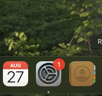
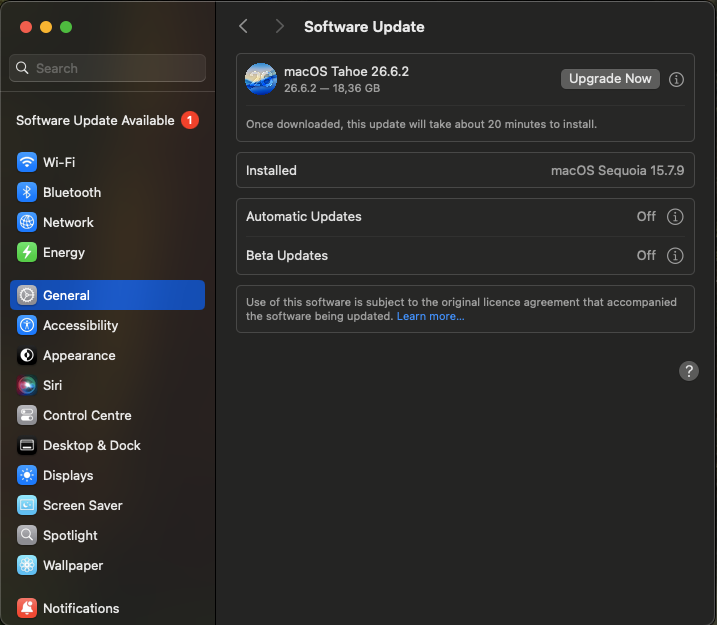
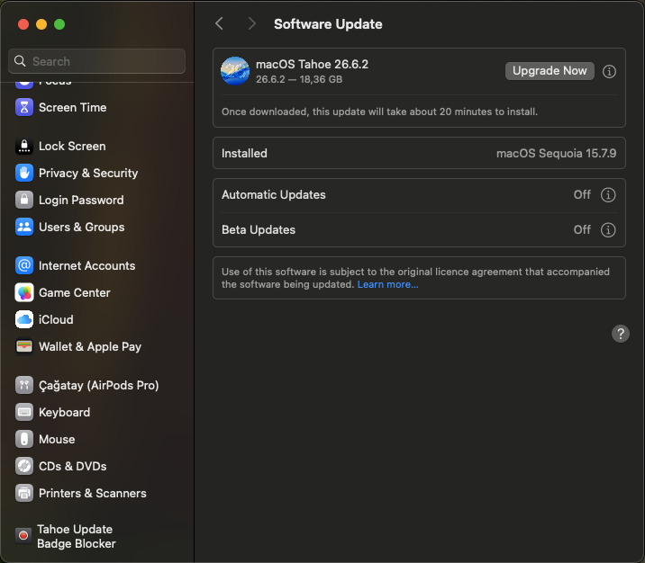
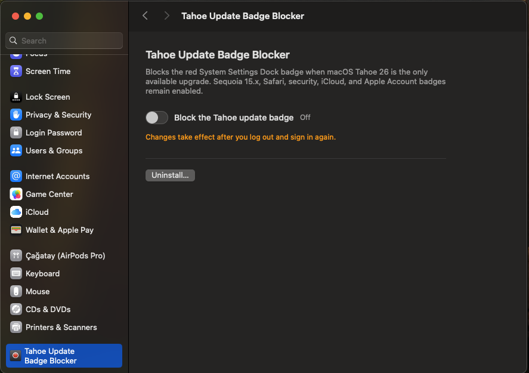
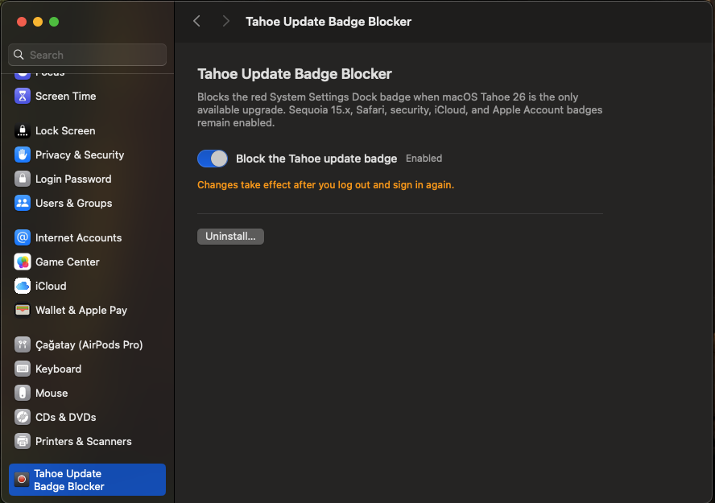

# Tahoe Update Badge Blocker

A small, open-source macOS Preference Pane that hides the red System Settings badge **only when macOS Tahoe 26 is the sole available upgrade**.

It is intended for people who deliberately remain on macOS Sequoia 15.x—especially OpenCore Legacy Patcher users whose Mac cannot safely move to Tahoe—but are still shown a permanent red “1” badge by System Settings.



## Why this exists

macOS may keep advertising Tahoe as an available upgrade even when you intentionally need to stay on Sequoia. The same red “1” then remains on the System Settings Dock icon and in the Settings sidebar. It looks like an important update is being ignored, although there may be no compatible Sequoia, Safari, or security update waiting.

For OCLP users this is more than visual clutter: clicking the badge repeatedly leads back to an upgrade that may not be suitable for the machine. Tahoe Update Badge Blocker removes that specific, irritating false urgency without hiding updates that still matter.

| Before: Tahoe creates a red “1” | After: Tahoe stays visible, its badge is hidden |
| --- | --- |
|  |  |

The Tahoe upgrade remains visible in Software Update. The blocker does not prevent, defer, download, or install any update.

## What it preserves

- macOS Sequoia 15.x updates
- Safari updates
- Security and other non-Tahoe updates
- iCloud, Apple Account, and unrelated System Settings attention badges

If the available update list cannot be classified safely, the blocker leaves the existing badge state unchanged.

## Install

1. Download `Tahoe-Update-Badge-Blocker-1.1.0.pkg` from the latest GitHub Release.
2. Open the package and complete the standard macOS Installer steps.
3. Open **System Settings → Tahoe Update Badge Blocker**.
4. Turn on **Block the Tahoe update badge**. The Dock tile refreshes immediately without restarting the Dock or requiring logout.

The current package is not notarized or signed with an Apple Developer ID. If macOS blocks it, Control-click the package, choose **Open**, and confirm. You should only install a package downloaded from this repository's Releases page; its SHA-256 checksum is published beside it.

| Disabled | Enabled |
| --- | --- |
|  |  |

> The screenshots above show an earlier development build with a logout notice. The current release applies switch changes immediately and no longer displays that persistent notice.

## Uninstall

Open **System Settings → Tahoe Update Badge Blocker** and click **Uninstall…**. The native Software Update badge behavior is restored and the preference pane, helper, and LaunchAgent are removed.

## How it works

The background helper checks the cached output of `softwareupdate --list --no-scan` every five minutes.

- Tahoe 26 only: suppress the Software Update attention entry.
- Sequoia, Safari, security, or another update: restore native badge behavior.
- Unknown or ambiguous output: make no change.

It modifies only the current user's System Settings preferences. It does not patch System Settings, change protected system files, or interfere with Software Update itself. It asks System Settings' existing Dock tile plug-in to refresh through its distributed notification, so the Dock process does not disappear or restart.

## Compatibility and limitations

- Designed and tested on macOS Sequoia 15.x.
- Requires macOS 13 or later.
- Built for both Intel and Apple silicon using the macOS toolchain.
- Apple does not provide a public API for selectively suppressing this badge. A future macOS update may change the underlying preference or `softwareupdate` output and require an update to this project.
- This project is independent of Apple and OpenCore Legacy Patcher.

## Privacy

Everything runs locally. There is no analytics, telemetry, account, network service, or update server in this project.

## Build from source

Xcode Command Line Tools are required.

```sh
make
make test
make package
```

`make package` produces the installer and SHA-256 checksum in `outputs/`. For a direct development install in the current user's Library folder, run `make install`.

## Türkçe

Bu araç, yalnızca macOS Tahoe 26 yükseltmesi bulunduğunda Sistem Ayarları rozetini gizler. Sequoia 15.x, Safari, güvenlik, iCloud ve Apple Hesabı uyarıları görünmeye devam eder. Tahoe yükseltmesini engellemez veya gizlemez; sadece bu yükseltmenin oluşturduğu kırmızı rozeti kaldırır. Anahtar değişiklikleri Dock yeniden başlatılmadan ve oturum kapatılmadan anında uygulanır.

## License

[MIT](LICENSE) © 2026 Çağatay Kılınç
